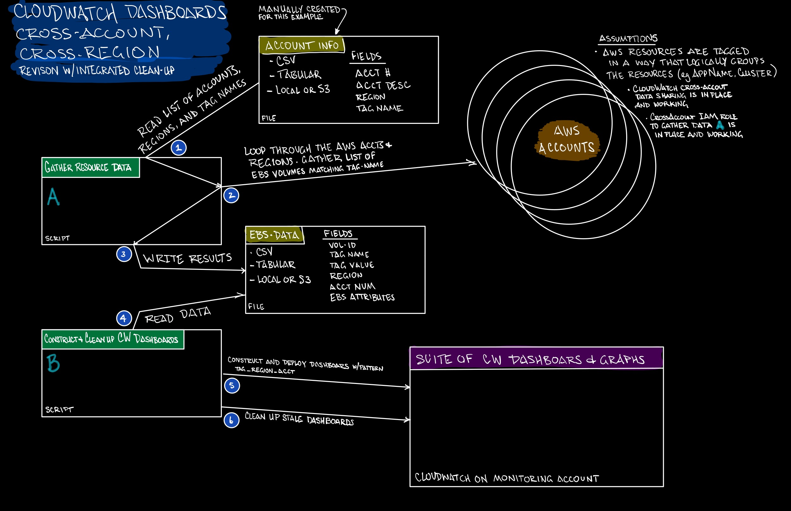

# EBS CloudWatch Monitoring - Cross Account and Cross Region

## Progress Tracking and TODO Items

[Cross-Account CloudWatch for EBS To Do Items](./TODO.md)

## Example Checklist

An [example checklist](./CHECKLIST.md) to use when reviewing and deploying this functionality.

## Overview and Structure



[Setting up CloudWatch Cross Account Observability, aka Observability Access Manager (OAM)](https://docs.aws.amazon.com/AmazonCloudWatch/latest/monitoring/CloudWatch-Unified-Cross-Account.html)

[Terraform Module for CloudWatch Observability Access Manager (OAM)](https://registry.terraform.io/providers/hashicorp/aws/latest/docs/resources/oam_link)

## Example of the Dashbaords

This is a short video of how the Cross-Account dashboards look once deployed.


## Elements and Concepts

Here are some of the elements involved:

- `Tags = Way to Group Dashboards` - the assumption is all AWS resources (EBS, EC2, etc) have a tag that can be leveraged to identify a way to group the dashboards. For example, the Application, relevant HDFS cluster, or similar.
- `account-info.csv` - a tabular data structure that has account number, region, account description, and tag name (tag name is how the Dashboards are grouped). This can be a local file or an S3 object.
- `Cross Account Role` - a cross-account "readonly "role that has access to gather the EBS and EC2 data (and, eventually other services).
- `Gather Data Python Script` - the script that reads the `account-info.csv` to get the list of accounts, regions, and tags, then connects to the accounts using the `CrossAccountRole` to gather the list of EBS volumes that match the \* `Tag Name` then writes the list to `ebs-data-csv` file. The assumption is the `Tag Name` is present for all dashboard items and is used to identify grouping, such as for Cluster.
- `ebs-data.csv` - the file (tabular csv format) that stores the list of EBS Volumes, This file is used by the `CloudWatch Dashboard Construction` script. This can be a local file or an S3 object.
- `CloudWatch Dashboard Construction Python Script` - A script that reads `ebs-data.csv` to construct the ecosystem of CloudWatch Dashboards by Tag Name, Region, and Account. On each Dashboard are all the related EBS Volumes.
  - `CloudWatch Navigation Dashboard` - Part of the `Construction` script creates top level CloudWatch Dashboard that helps end-users navigate the different clusters,
  - `CloudWatch Dashboard Cleanup` - Part of the `Construction` script reads all the relevant CloudWatch Dashboards and removes any stale dashboards.

### Account Information

The account information is a csv formatted file with a list of AWS Accounts. This Account Information file is local or S3. It has the following fields in CSV format:

`account-number`,`region`,`account-description`,`tag-name`

[Example Account Info](./account-info-example.csv)

### Gathering and Writing the Data for the Dashboards

The `Gather Data Python Script` cycles through the AWS Accounts and each specified region, collecting the EBS volumes based on the tag-name.

The gather data script leverages A `Cross Account Role` is required to access the target accounts and query for the tagged resources. See below for the relevant IAM configuration.

The `Gather Data Python Script` writes a data file that has the volume-level information in tabular format. The contents of this file is used to construct and update a suite of CloudWatch Dashboards. This file can reside locally or in S3. It has the following fields in csv format:

`Account-Number`,`Account-Description`,`Region`,`Volume-ID`,`Volume-Status`,`Volume-Size`,`Volume-Type`,`Tag-Name`,`Tag-Value`

[Example Data File](./ebs-data-example.py)

### Constructing and Cleaning Up the CloudWatch Dashboards

The `CloudWatch Dashboard Construction Python Script` reads the `ebs-data.csv` file to construct or update the suite of CloudWatch Dashboards.

The script takes into consideration the CloudWatch Dashboard Limits, such as metrics per Dashboard. It will "shard" the dashboards to avoid hitting limits.

Once the CloudWatch Dashbaords are updated/created, the script gets the existing CloudWatch Dashboards based on a naming pattern defined using the `Config.CW_DASHBOARD_NAME_PREFIX` in the `Construction` script. It then compares the list of dashboards and deletes any stale dashboards.

## Risk and Open Questions

- Figuring out how to deploy the cross-account, cross-region CloudWatch capabilities using automation (Terraform, CFM, Python, etc).
  - Update: [Terraform capabilities - OAM - Observability Access Manager](https://registry.terraform.io/providers/hashicorp/aws/latest/docs/resources/oam_link)
- Frequency and Impact of Dashboard updates - if these dashboards are actively used, what happens when the content is changed or the Dashboard deleted
- Mechanisms to trigger the script(s) - options include SSM Automation (by an event or on a scheduler), CRON jobs on a EKS Pod
- Expand behond EBS to other services, such as EC2, EKS, Network, and more.

## Pre-Requisits

Also refer to the [CHECKLIST](./CHECKLIST.md)

- IAM Role with Policies to gather the EBS, EC2, and CloudWatch metadata. [Terraform Version](./cross-account-setup-data-gather-terraform/)
- [CloudWatch Cross-Account, Cross Region setup](./cross-account-setup-cloudwatch) | (Link to AWS Documentation)(https://docs.aws.amazon.com/AmazonCloudWatch/latest/monitoring/CloudWatch-Unified-Cross-Account.html)
- IAM Role with Policies that can create, update, delete CloudWatch dashboards and metrics in the target accounts.

TODO: Add Policy Examples

### Cross Account IAM Role

There is the main account, the one you'll run the scripts from, then there are target accounts that the role will access. This concept is a tad backwards from how the cross-account CloudWatch data flow setup is done.

TODO: Reconcile the naming to match the cross-account CloudWatch data flow setup terminology. Perhaps call the main account running the scripts the "monitoring account" and the target accounts being accessed the "observed accounts".

In the main observability account (or the one that you'll run the scripts from), create an IAM role with the following trust relationship and policies:

TODO: Insert IAM policy statement

In the target accounts (source accounts), add a policy to the cross account role that allows getting relevant information in those accounts.

TODO: Insert IAM policy statement

## Utilities

- [EC2 Deployment Utility for Testing](../../ebs-end-to-end-testing/e2e-launch-ec2-instances.py)] - this is an example Python script that deploys EC2 instances for testing purposes. Each EC2 and EBS volume deployed is tagged consistently so they can be terminated after testing. There are options for the number of instances, number and type of EBS volumes to attach to each instance, and the ability to deploy to different AWS Regions.

### Utilities to be developed

`ebs-xacct-util.py` - utility to list volumes, tag, etc across all included AWS Accounts.

`ebs-cw-xacct-latency.py` - utility to list CloudWatch metrics that make up read/write latency across all EBS volumes across all AWS Accounts.

`ebs-cw-xacct-impairedvol.py` - utility to list CloudWatch metrics that make up Impaired Volume across all EBS volumes across all AWS Accounts.

## Dashboards

The CloudWatch Dashboard "Ecosystem" is a collection based on the Account Number, Region, and Specific Tag Names.

At the top level if a "navigation" dashboard that links to the different sub-dashboards.

Each sub-dashboard has a unique combination of Account Number, Region, and Tag Name/Value. For scaling purposes, the dashboard limits are taken into consideration. Currently (Oct 2023) there is a 2500 metric limit per CloudWatch Dashboard. The logic will "shard" the dashboards.

For example, as sub-dashboard might look something like:

`EBS_ClusterName_Cluster123_1_us-west-2_12345678901234`

### CloudWatch Dashboard Considerations

The constraints for CloudWatch Dashboards exist. Currently there are two main constraints to consider:

- Metrics per Dashboard
- Metrics per Graph

For this effort, the script exits if the metrics per graph exceed the limit. For the Metrics per Dashboard, the script will shard the dashboards, for example:

- `EBS_ClusterName_Cluster123_1_us-west-2_12345678901234`
- `EBS_ClusterName_Cluster123_2_us-west-2_12345678901234`

### Construction by Tag

Hypothesis: for larger deployments, the way to manage EBS dashboards and alarms is by leveraging Tags to navigate. With a multi-account strategy, the tags become critical to the management of the Dashboards.

The account list will include all of the relevant Tag Names for each account. For example, if an account has ClusterName as a tag - that is one entry on the account list. If there is a second tag for the same account called Environment, that will be a separate line item in the Account List. The term for this concept is tabular data - every row has all data elements. Here is an example:

`12345678901234`,`us-west-2`,`SuperAppProd`,'ClusterName`
`12345678901234`,`us-west-2`,`SuperAppProd`,'AppName`
`12345678901234`,`us-east-2`,`SuperAppProd`,'ClusterName`
`12345678901234`,`us-east-2`,`SuperAppProd`,'AppName`

### Dashboard Navigation

A singluar Navigation Dashboard called **EBS_NAV** will have widgets with link to each sub-dashboard

A secondary navigation dashboard by Account & Region

```markdown
- _EBS_NAV_

  - \_EBS_NAV_Account Description

    - \_EBS_NAV_Account Description_Region

  - \_EBS_NAV_Region

    - \_EBS_NAV_Region_Account Description

      - \_EBS_NAV_Region_Account Description_Account Number
```

### Sub-Dashboard Patterns

Structure:
`[Link to _EBS_NAV_ Dashboard]`

[Widget with each EBS Volume with key EBS Metrics] (assuming each Widget has less than 500 metrics)

Dashboard sharding will happen when the Dashboard reaches the maxium number of metrics per dashboard.

Dashboard Name:
`EBS_<TagName>_<TagValue>_<#>_<AcctName>_<AcctNum>` - where <#> is the shard number

Widget Name
`EBS_<TagName>_<TagValue>_<VolId>_<AcctName>_<AcctNum>`
