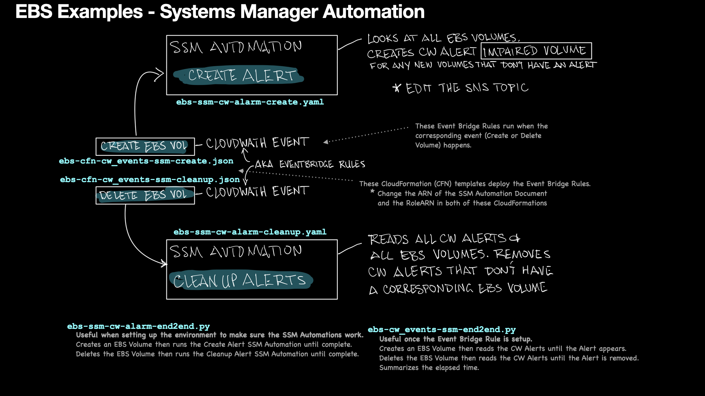

# STATUS OF SCRIPT:

READY FOR REVIEW as of 8/15

# AWS Systems Manager Automation - EBS Monitoring

This folder contains examples of using AWS Systems Manager (SSM) Automation to create Alerts for newly created EBS Volumes and to clean up alerts for EBS Volumes that no longer exist.

There are several IAM requirements that need to be met. There is a summarized view below and a specific set for each script/SSM Document.

# Visual Overview

This visual shows the complete example, including the end to end test scripts, cloudformation templates, and SSM Automation.



## Files

This folder has the following files:

- `ebs-ssm-cw-alarm-create.yaml` - SSM Automation document to create CloudWatch alarms on all existing EBS volumes
- `ebs-ssm-cw-alarm-cleanup.yaml` - SSM Automation document to clean up old CloudWatch alarms when volumes are deleted
- `ebs-cfn-cw_events-ssm-create.json` - CloudFormation template to create EventBridge rule to trigger alarm creation automation
- `ebs-cfn-cw_events-ssm-cleanup.json` - CloudFormation template for cleanup automation
- `ebs-ssm-cw-alarm-end2end.py` - Python script to test end-to-end automation workflow

## Terraform

The Terraform version of this functionality is in the [terraform-alert-automation](../terraform-alert-automation/) folder.

# Examples SSM Automations

## ebs-ssm-cw-alarm-create.yaml

### Overview of `ebs-ssm-cw-alarm-create.yaml`

This script creates a CloudWatch alarm named "ImpairedVol\_" followed by the Volume ID for all EBS volumes in your AWS account. The alarm is triggered if `(VolumeReadOps + VolumeWriteOps) = 0 and VolumeQueueLength > 0` for 5 minutes.

### Features

- Automatically lists all the EBS volumes in the account. Note: the script is configured to paginate every 300 items. This is adjustable using the `PAGINATE_COUNT` constant in the code.
- Creates a CloudWatch alarm for each volume based on the defined metric.
- Utilizes AWS Systems Manager (SSM) to automate the process.

### Requirements

- AWS CLI or SDK properly configured.
- Appropriate IAM permissions (detailed below).
- IAM Permissions
- The following IAM permissions are required to execute this script:

```json
{
  "Version": "2012-10-17",
  "Statement": [
    {
      "Sid": "EC2Permissions",
      "Effect": "Allow",
      "Action": ["ec2:DescribeVolumes"],
      "Resource": "*"
    },
    {
      "Sid": "CloudWatchPermissions",
      "Effect": "Allow",
      "Action": [
        "cloudwatch:PutMetricAlarm",
        "cloudwatch:DeleteAlarms",
        "cloudwatch:DescribeAlarms"
      ],
      "Resource": "*"
    },
    {
      "Sid": "SSMPermissions",
      "Effect": "Allow",
      "Action": [
        "ssm:CreateDocument",
        "ssm:DeleteDocument",
        "ssm:DescribeDocument",
        "ssm:UpdateDocument",
        "ssm:ExecuteAutomation"
      ],
      "Resource": "*"
    }
  ]
}
```

### Usage

1. Upload the YAML document to AWS Systems Manager (SSM) as an SSM Automation document.
2. Execute the SSM Automation, either manually through the AWS Management Console or programmatically through the AWS CLI/SDK.

### SNS Topic

The script references an SNS topic ARN that you will not have access to. Adjust the `SNS_ALARM_ACTION_ARN` constant in the script to reflect your SNS topic. Make sure the topic is properly configured to receive notifications for the alarms.

### Notes

Make sure to thoroughly test this script in a non-production environment before using it in a production setting. Always ensure that IAM permissions are configured according to the principle of least privilege.

## ebs-ssm-cw-alarm-cleanup.yaml

### Overview

This SSM Automation script named `CleanupCloudWatchAlarms` is designed to clean up CloudWatch Alarms for non-existent EBS Volumes. It deletes CloudWatch Alarms with the pattern `ImpairedVol_{volume-id}` if they do not correspond to existing EBS Volumes.

### Features

- **Cleanup of CloudWatch Alarms**: Automatically identifies and deletes CloudWatch Alarms for non-existent EBS Volumes.
- **Integration with EC2**: Queries existing EBS Volumes to determine which alarms to delete.

### Requirements

#### Environment Requirements

- **AWS Account**: You must have an AWS account and permissions to execute SSM Automation documents.
- **Region**: Deploy this automation in the desired AWS region.

#### IAM Requirements

Ensure that the IAM Role or User executing this automation has the following permissions (this mirrors the IAM requirements for the `ebs-ssm-cw-alarm-create.yaml` SSM Automation document):

```json
{
  "Version": "2012-10-17",
  "Statement": [
    {
      "Sid": "EC2Permissions",
      "Effect": "Allow",
      "Action": ["ec2:DescribeVolumes"],
      "Resource": "*"
    },
    {
      "Sid": "CloudWatchPermissions",
      "Effect": "Allow",
      "Action": [
        "cloudwatch:PutMetricAlarm",
        "cloudwatch:DeleteAlarms",
        "cloudwatch:DescribeAlarms"
      ],
      "Resource": "*"
    },
    {
      "Sid": "SSMPermissions",
      "Effect": "Allow",
      "Action": [
        "ssm:CreateDocument",
        "ssm:DeleteDocument",
        "ssm:DescribeDocument",
        "ssm:UpdateDocument",
        "ssm:ExecuteAutomation"
      ],
      "Resource": "*"
    }
  ]
}
```

### Usage

Execute this SSM Automation script using the AWS Management Console or the AWS CLI.

#### Example AWS CLI command to start the automation execution

```bash
aws ssm start-automation-execution --document-name "CleanupCloudWatchAlarms"
```

#### CloudFormation Examples

These examples show how to deploy the Event Bridge Rules that watch for Create EBS Volume and Delete EBS Volume.

## CloudFormation `ebs-cfn-cw_events-ssm-cleanup.json`

### Summary

This CloudFormation template sets up an EventBridge rule named `ebs-cw-alarm-impairedvol-cleanup` that cleans up CloudWatch Alarms for EBS Volumes that no longer exist.

### Features

- **EventBridge Rule**: Creates an EventBridge rule that listens for EBS Volume notifications and triggers a cleanup action.
- **Clean Up Alarms**: Automatically deletes CloudWatch Alarms for non-existent EBS Volumes.

### Environment Requirements

- **AWS Account**: You must have an AWS account and permissions to create CloudFormation stacks.
- **Region**: Deploy this template in the desired AWS region.

### IAM Requirements

Ensure that the IAM Role or User deploying this template has the following permissions:

- **CloudFormation permissions**: (e.g., `cloudformation:CreateStack`, `cloudformation:UpdateStack`).
- **EventBridge permissions**: (e.g., `events:PutRule`, `events:PutTargets`).
- **CloudWatch permissions**: (e.g., `cloudwatch:DeleteAlarms`).

### Things to Change in the CloudFormation Template

- **EventBusName**: If you are using a custom EventBus other than "default," you will need to modify this value.
- **Targets: Id**: The ID of the SSM Automation
- **Targets: Arn**: The ARN of the SSM Automation
- **Targets: RoleArn**: The RoleArn of the IAM Role that will run the Automation.

# TODO Items

- Have the Alert Create function run just on the newly created or newly deleted volume. Currently the SSM Automation scripts run through all EBS volumes. That is heavy if there are a lot of volumes (1000s).
